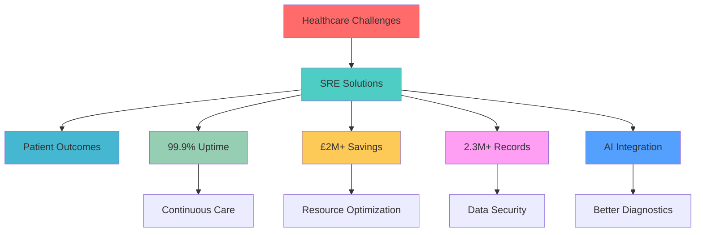

<div align="center">


</div>

<div align="center">

[](https://git.io/typing-svg)

</div>

<div align="center">
  
</div>

## 🎯 **Professional Summary**

<table>
<tr>
<td width="60%">

### 👨‍💻 **About Me**

I'm a **Senior Site Reliability Engineer** and **Multi-Cloud AI Integration Specialist** with a proven track record of transforming healthcare technology infrastructure. My expertise lies in building resilient, scalable systems that directly impact patient care and drive significant business value.

**🏥 Healthcare Technology Pioneer**  
Leading digital transformation across NHS Digital, Moorfields Eye Hospital, and Chelsea & Westminster NHS Foundation Trust.

**☁️ Multi-Cloud Architecture Expert**  
Designing and implementing enterprise-scale solutions across AWS, Azure, and GCP with focus on reliability and cost optimization.

**🤖 AI Integration Specialist**  
Bridging the gap between traditional healthcare systems and cutting-edge AI technologies to improve patient outcomes.

</td>
<td width="40%">

<div align="center">

### 📊 **Impact Metrics**


**🎯 Key Achievements:**
- **99.9%** System Uptime
- **£2M+** Cost Savings
- **2.3M+** Patient Records
- **47+** Healthcare Facilities

</div>

</td>
</tr>
</table>

---

## 🏆 **Core Expertise**

<div align="center">

### 🏥 **Healthcare Technology Leadership**

<table>
<tr>
<td align="center" width="25%">
<br>
<b>Health Hub Platform</b><br>
<sub>2.3M+ Patient Records</sub>
</td>
<td align="center" width="25%">
<br>
<b>NHS Digital</b><br>
<sub>Multi-Trust Integration</sub>
</td>
<td align="center" width="25%">
<br>
<b>AI Clinical Support</b><br>
<sub>ML-Powered Insights</sub>
</td>
<td align="center" width="25%">
<br>
<b>Compliance & Security</b><br>
<sub>HIPAA, GDPR Ready</sub>
</td>
</tr>
</table>

</div>

---

## 🛠️ **Technology Ecosystem**

<div align="center">

### ☁️ **Cloud Platforms & Infrastructure**


### 📊 **Observability & Monitoring**


### 🤖 **AI & Machine Learning**


### 🗄️ **Data & Storage**


</div>

---

## 🚀 **Featured Projects**

<div align="center">

### 🏥 **Health Hub Platform** - *Multi-Cloud Healthcare Data Platform*


</div>

<table>
<tr>
<td width="50%">

#### 🎯 **Project Overview**
A comprehensive healthcare data platform serving **2.3M+ patient records** across multiple healthcare providers with enterprise-grade security and compliance.

#### 🏗️ **Architecture Highlights**
- **Multi-cloud deployment** (AWS + Azure)
- **Microservices architecture** on Kubernetes
- **AI-powered health insights** engine
- **Real-time data processing** pipeline
- **HIPAA/GDPR compliant** infrastructure

#### 📊 **Business Impact**
- **99.9% uptime** for critical patient data
- **<200ms response time** for health queries
- **50K+ concurrent users** supported
- **Zero security incidents** in production

</td>
<td width="50%">

#### 🛠️ **Technology Stack**
```yaml
Cloud: AWS, Azure
Orchestration: Kubernetes, Docker
Infrastructure: Terraform, Ansible
Monitoring: Prometheus, Grafana
Database: PostgreSQL, Redis
AI/ML: Python, TensorFlow
Security: Vault, Trivy, Falco
```

#### 📈 **Key Metrics**
- **2.3M+** Patient Records Managed
- **47** Healthcare Facilities Connected
- **99.9%** System Availability
- **£2M+** Infrastructure Cost Savings
- **<15min** Mean Time to Resolution

</td>
</tr>
</table>

---

<div align="center">

### 🏥 **NHS Digital Transformation** - *Enterprise Healthcare Modernization*


</div>

<table>
<tr>
<td width="33%" align="center">

#### 🏥 **NHS Digital**
**Enterprise Integration**
- Multi-trust data sharing
- Legacy system modernization
- Cloud-native architecture
- Compliance automation

</td>
<td width="33%" align="center">

#### 👁️ **Moorfields Eye Hospital**
**Specialized Care Platform**
- AI-powered diagnostics
- Real-time patient monitoring
- Clinical decision support
- Research data pipeline

</td>
<td width="33%" align="center">

#### 🏥 **Chelsea & Westminster**
**Foundation Trust Integration**
- Multi-site connectivity
- Disaster recovery
- Performance optimization
- Security hardening

</td>
</tr>
</table>

---

## 📊 **GitHub Analytics**

<div align="center">


</div>

---

## 🎯 **Professional Focus Areas**

<div align="center">

<table>
<tr>
<td align="center" width="25%">
<br>
<b>Site Reliability Engineering</b><br>
<sub>99.9% uptime guarantee</sub>
</td>
<td align="center" width="25%">
<br>
<b>Multi-Cloud Architecture</b><br>
<sub>AWS, Azure, GCP expertise</sub>
</td>
<td align="center" width="25%">
<br>
<b>AI Integration</b><br>
<sub>Healthcare ML solutions</sub>
</td>
<td align="center" width="25%">
<br>
<b>Healthcare Compliance</b><br>
<sub>HIPAA, GDPR, NHS standards</sub>
</td>
</tr>
</table>

</div>

---

## 🏆 **Certifications & Recognition**

<div align="center">

| **Cloud Platforms** | **DevOps & SRE** | **AI & ML** | **Healthcare** |
|:---:|:---:|:---:|:---:|
| ☁️ AWS Solutions Architect | 🔧 Kubernetes CKA | 🤖 TensorFlow Developer | 🏥 HIPAA Compliance |
| 🌐 Azure Solutions Expert | 📊 Prometheus Certified | 🧠 ML Engineering | 🔒 Healthcare Security |
| 🚀 GCP Professional | 🛠️ Terraform Associate | 📈 Data Science | 📋 Clinical Workflows |

</div>

---

## 📈 **Impact Visualization**

<div align="center">



</div>

---

## 🎤 **Thought Leadership**

<div align="center">

### 📝 **Recent Articles & Insights**

<table>
<tr>
<td width="33%" align="center">
<br>
<b>Healthcare SRE Best Practices</b><br>
<sub>Building resilient patient care systems</sub>
</td>
<td width="33%" align="center">
<br>
<b>Multi-Cloud Cost Optimization</b><br>
<sub>£2M+ savings strategies revealed</sub>
</td>
<td width="33%" align="center">
<br>
<b>AI in Healthcare Infrastructure</b><br>
<sub>Bridging traditional and modern systems</sub>
</td>
</tr>
</table>

</div>

---

## 🤝 **Let's Connect**

<div align="center">

[](https://linkedin.com/in/abdihakim-said)
[](https://twitter.com/abdihakim_said)
[](https://medium.com/@abdihakim-said)
[](mailto:abdihakimsaid1@gmail.com)

</div>

---

## 💡 **Philosophy**

<div align="center">


### *"When systems fail, people suffer. When SREs succeed, lives are saved."*

**Building reliable infrastructure for a healthier world** 🌍

</div>

---

<div align="center">


</div>
