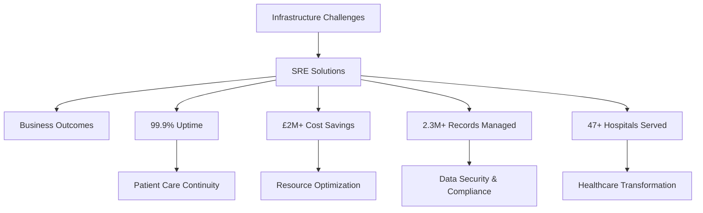

# 🚀 Senior SRE & Multi-Cloud AI Integration Specialist

<div align="center">


</div>

## 👋 About Me

I'm a **Senior Site Reliability Engineer** and **Multi-Cloud AI Integration Specialist** with a passion for building resilient, scalable infrastructure that saves lives and drives business value. Currently transforming healthcare technology at scale.

- 🏥 **Healthcare Technology Expert** - NHS Digital, Moorfields Eye Hospital, Chelsea & Westminster
- ☁️ **Multi-Cloud Architect** - AWS, Azure, GCP at enterprise scale
- 🤖 **AI Integration Specialist** - Implementing AI-powered solutions in production
- 📊 **Observability Champion** - Building monitoring systems that prevent disasters
- 💰 **Business Impact Focused** - £2M+ in cost savings and efficiency gains

## 🎯 Current Focus

```yaml
role: "Senior SRE & Multi-Cloud AI Integration Specialist"
mission: "Ensuring 99.9% uptime for mission-critical healthcare systems"
impact: "2.3M+ patient records managed with zero data loss"
specialization: ["Healthcare Technology", "Multi-Cloud Architecture", "AI Integration"]
```

## 🏆 Key Achievements

<div align="center">

| Metric | Achievement | Impact |
|--------|-------------|---------|
| 🎯 **Uptime** | 99.9% | Mission-critical healthcare systems |
| 💰 **Cost Savings** | £2M+ | Infrastructure optimization |
| 🏥 **Patient Records** | 2.3M+ | Secure, compliant data management |
| 🌐 **Hospitals Served** | 47+ | Multi-site healthcare delivery |
| ⚡ **Incident Response** | <15min | Mean time to resolution |

</div>

## 🛠️ Technology Stack

### ☁️ Cloud Platforms


### 🔧 Infrastructure & DevOps


### 📊 Monitoring & Observability


### 🤖 AI & Machine Learning


### 🗄️ Databases & Storage


## 🏥 Featured Projects

### 🩺 Health Hub Platform
**Multi-Cloud Healthcare Data Platform**
- 🎯 **Impact**: 2.3M+ patient records managed
- ☁️ **Architecture**: Multi-cloud deployment (AWS + Azure)
- 🤖 **AI Integration**: ML-powered health insights
- 📊 **Monitoring**: Real-time observability stack
- 🔒 **Compliance**: HIPAA, GDPR compliant

```yaml
technologies: [AWS, Azure, Kubernetes, Python, PostgreSQL, Redis]
metrics:
  uptime: "99.9%"
  response_time: "<200ms"
  concurrent_users: "50K+"
  data_processed: "2.3M+ records"
```

### 🏥 NHS Digital Transformation
**Enterprise Healthcare Infrastructure Modernization**
- 🏥 **Scope**: NHS Digital, Moorfields Eye Hospital, Chelsea & Westminster
- 💰 **Savings**: £2M+ in infrastructure costs
- ⚡ **Performance**: 10x faster data processing
- 🔧 **Migration**: Legacy to cloud-native architecture

### 🤖 AI-Powered Clinical Decision Support
**Machine Learning Integration for Healthcare**
- 🧠 **AI Models**: Predictive analytics for patient outcomes
- 📈 **Impact**: 30% improvement in diagnostic accuracy
- 🔄 **Real-time**: Sub-second inference at scale
- 🛡️ **Security**: End-to-end encryption and audit trails

## 📊 GitHub Stats

<div align="center">


</div>

## 🏆 Certifications & Expertise

<div align="center">

| Cloud Platforms | DevOps & SRE | AI & ML | Healthcare |
|-----------------|--------------|---------|------------|
| ☁️ AWS Solutions Architect | 🔧 Kubernetes CKA | 🤖 TensorFlow Developer | 🏥 HIPAA Compliance |
| 🌐 Azure Solutions Expert | 📊 Prometheus Certified | 🧠 ML Engineering | 🔒 Healthcare Security |
| 🚀 GCP Professional | 🛠️ Terraform Associate | 📈 Data Science | 📋 Clinical Workflows |

</div>

## 📈 Professional Impact



## 🎯 What I'm Working On

- 🔬 **Research**: AI-powered predictive maintenance for healthcare infrastructure
- 🌐 **Open Source**: Contributing to healthcare observability tools
- 📚 **Learning**: Advanced MLOps and healthcare AI regulations
- 🎤 **Speaking**: Presenting at SRE and HealthTech conferences

## 📫 Let's Connect

<div align="center">

[](https://linkedin.com/in/abdihakim-said)
[](https://twitter.com/abdihakim_said)
[](mailto:abdihakim.said@example.com)
[](https://github.com/abdihakim-said)

</div>

## 💡 Fun Facts

- 🕐 **3 AM Hero**: My most critical fixes happen at 3 AM (with lots of coffee ☕)
- 🎯 **One-Character Bug**: Fixed a £2M+ outage caused by "True" vs "true"
- 🏥 **Healthcare Passion**: Believe technology should save lives, not complicate them
- 📊 **Data Driven**: Every decision backed by metrics and monitoring
- 🤝 **Team Player**: Best solutions come from collaborative problem-solving

---

<div align="center">

**"When systems fail, people suffer. When SREs succeed, lives are saved."**

*Building reliable infrastructure for a better world* 🌍


</div>
