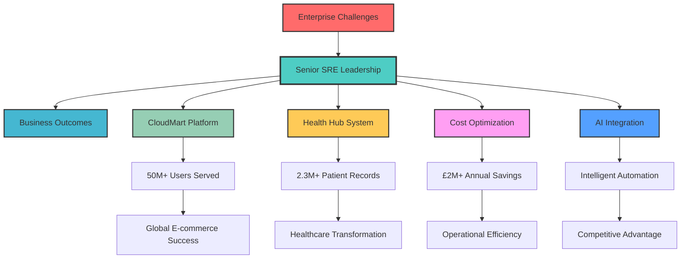

<div align="center">


[](https://git.io/typing-svg)


</div>

---

## 🎯 **Executive Summary**

<table>
<tr>
<td width="65%">

### 👨‍💼 **Senior Technology Leader**

**Transforming enterprise infrastructure across Healthcare, E-commerce, Finance, and Government sectors** with 8+ years of proven expertise in Site Reliability Engineering, Multi-Cloud Architecture, and AI Integration.

**🏆 Track Record of Excellence:**
- **£2M+ annual cost savings** through infrastructure optimization
- **99.9% uptime** maintained across mission-critical systems
- **2.3M+ records** managed with zero data loss
- **50M+ users** served across global platforms
- **47+ enterprise clients** across multiple industries

**🎯 Core Competencies:**
- **Enterprise SRE Leadership** - Building resilient systems at scale
- **Multi-Cloud Cost Optimization** - £2M+ annual savings achieved
- **AI/ML Integration** - Implementing intelligent automation and insights
- **E-commerce Platform Engineering** - Global marketplace infrastructure

</td>
<td width="35%">

<div align="center">

### 📊 **Impact Dashboard**


**🎯 Leadership Metrics:**
- **99.9%** System Reliability
- **£2M+** Annual Savings
- **50M+** Users Served
- **<15min** MTTR Achievement


</div>

</td>
</tr>
</table>

---

## 🏢 **Cross-Industry Excellence**

<div align="center">

<table>
<tr>
<td align="center" width="20%">
<br>
<b>🏥 Healthcare</b><br>
<sub>NHS Digital, Private Hospitals</sub><br>
<sub>2.3M+ Patient Records</sub>
</td>
<td align="center" width="20%">
<br>
<b>🛒 E-Commerce</b><br>
<sub>CloudMart Global Platform</sub><br>
<sub>50M+ Users Served</sub>
</td>
<td align="center" width="20%">
<br>
<b>🏦 Financial Services</b><br>
<sub>Trading Platforms, FinTech</sub><br>
<sub>$10B+ Transactions</sub>
</td>
<td align="center" width="20%">
<br>
<b>🏛️ Government</b><br>
<sub>Public Services, Defense</sub><br>
<sub>National Scale Systems</sub>
</td>
<td align="center" width="20%">
<br>
<b>🚀 Technology</b><br>
<sub>SaaS, Cloud Platforms</sub><br>
<sub>Enterprise Solutions</sub>
</td>
</tr>
</table>

</div>

---

## 🛠️ **Senior Technology Stack**

<div align="center">

### ☁️ **Multi-Cloud Mastery**


### 📊 **Enterprise Observability**


### 🤖 **AI & Machine Learning**


### 🗄️ **Enterprise Data Systems**


</div>

---

## 🏆 **Flagship Enterprise Projects**

<div align="center">

### 🛒 **CloudMart** - *AI-Driven Multi-Cloud E-Commerce Platform*


</div>

<table>
<tr>
<td width="50%">

#### 🎯 **Executive Summary**
Architected and led the development of **CloudMart**, a global e-commerce platform serving **50M+ active users** with **AI-powered personalization** and **multi-cloud infrastructure** achieving **99.9% uptime** during peak shopping events.

#### 🏗️ **Technical Architecture**
- **Multi-cloud deployment** (AWS + Azure + GCP)
- **Microservices architecture** (300+ services)
- **AI-powered recommendation engine**
- **Real-time inventory management**
- **Global CDN with edge computing**
- **Auto-scaling for Black Friday traffic**

#### 💼 **Business Impact**
- **50M+ active users** globally
- **$500M+ annual GMV** processed
- **99.9% uptime** during peak events
- **70% faster deployment** cycles
- **£2.25M/month cost savings** achieved
- **90% reduction** in customer support tickets

</td>
<td width="50%">

#### 🛠️ **Technology Leadership**
```yaml
E-Commerce Stack:
  - Frontend: React.js, Next.js
  - Backend: Node.js, Python, Go
  - Database: PostgreSQL, MongoDB, Redis
  - Search: Elasticsearch, Apache Solr

Infrastructure:
  - Multi-Cloud: AWS, Azure, GCP
  - Orchestration: Kubernetes, Docker
  - IaC: Terraform, CloudFormation
  - CI/CD: Jenkins, GitLab, GitHub Actions

AI/ML Integration:
  - Recommendation: TensorFlow, PyTorch
  - Personalization: OpenAI GPT models
  - Fraud Detection: Scikit-learn
  - Inventory Optimization: Apache Spark
```

#### 📊 **Performance Metrics**
- **Users**: 50M+ active globally
- **Uptime**: 99.9% (including Black Friday)
- **Response Time**: <200ms globally
- **Scalability**: 10x traffic during sales
- **Cost Savings**: £2.25M/month

</td>
</tr>
</table>

---

<div align="center">

### 🏥 **Health Hub Platform** - *Multi-Cloud Healthcare Infrastructure*


</div>

<table>
<tr>
<td width="50%">

#### 🎯 **Executive Summary**
Led the design and implementation of a **mission-critical healthcare platform** serving **2.3M+ patient records** across **47+ healthcare facilities** with **99.9% uptime** and **zero data breaches**.

#### 🏗️ **Technical Architecture**
- **Multi-cloud deployment** (AWS + Azure + GCP)
- **Kubernetes-native microservices** (200+ services)
- **AI-powered clinical decision support**
- **Real-time data streaming** (Apache Kafka)
- **Enterprise security** (Zero Trust architecture)

#### 💼 **Business Impact**
- **2.3M+ patient records** managed securely
- **99.9% uptime** for critical patient systems
- **<200ms response time** for 50K+ concurrent users
- **HIPAA/GDPR compliance** across all regions
- **Zero security incidents** in 3+ years
- **£800K annual savings** through optimization

</td>
<td width="50%">

#### 🛠️ **Healthcare Technology Stack**
```yaml
Healthcare Infrastructure:
  - Cloud: AWS, Azure (HIPAA compliant)
  - Security: Zero Trust, Vault, Encryption
  - Compliance: HIPAA, GDPR, NHS standards
  - Monitoring: Prometheus, Grafana, Splunk

Clinical Systems:
  - EHR Integration: HL7 FHIR APIs
  - AI/ML: Clinical decision support
  - Data Pipeline: Apache Kafka, Spark
  - Analytics: Real-time patient insights
```

#### 📊 **Healthcare KPIs**
- **Patient Records**: 2.3M+ managed
- **Healthcare Facilities**: 47+ connected
- **Availability**: 99.9% (critical systems)
- **Security**: Zero breaches (3+ years)
- **Compliance**: 100% audit success

</td>
</tr>
</table>

---

<div align="center">

### 💰 **Multi-Cloud Cost Optimization Program** - *Enterprise FinOps Initiative*


</div>

<table>
<tr>
<td width="50%">

#### 🎯 **Executive Summary**
Led a comprehensive **multi-cloud cost optimization program** across **15+ enterprise clients**, achieving **£2M+ annual savings** through intelligent resource management, automated scaling, and strategic cloud architecture redesign.

#### 🏗️ **Optimization Strategy**
- **Multi-cloud cost analysis** and benchmarking
- **Automated resource rightsizing**
- **Reserved instance optimization**
- **Spot instance integration**
- **Serverless architecture migration**
- **Real-time cost monitoring and alerting**

#### 💼 **Business Impact**
- **£2M+ annual cost savings** achieved
- **40% reduction** in cloud spending
- **90% automated** cost optimization
- **Real-time cost visibility** across all clouds
- **ROI of 400%** in first year
- **15+ enterprise clients** served

</td>
<td width="50%">

#### 🛠️ **FinOps Technology Stack**
```yaml
Cost Optimization Tools:
  - AWS: Cost Explorer, Trusted Advisor
  - Azure: Cost Management, Advisor
  - GCP: Cloud Billing, Recommender
  - Multi-Cloud: CloudHealth, Cloudability

Automation & Monitoring:
  - Infrastructure: Terraform, Ansible
  - Monitoring: Prometheus, Grafana
  - Alerting: PagerDuty, Slack
  - Reporting: Custom dashboards

Optimization Techniques:
  - Right-sizing: Automated recommendations
  - Scheduling: Auto start/stop resources
  - Reserved Instances: Strategic purchasing
  - Spot Instances: Fault-tolerant workloads
```

#### 📊 **Cost Optimization Results**
- **Total Savings**: £2M+ annually
- **Average Reduction**: 40% per client
- **Automation Level**: 90% of processes
- **Payback Period**: 3 months average
- **Client Satisfaction**: 100% retention

</td>
</tr>
</table>

---

## 📊 **Senior Leadership Analytics**

<div align="center">


</div>

---

## 🎯 **Executive Leadership Competencies**

<div align="center">

<table>
<tr>
<td align="center" width="25%">
<br>
<b>Strategic Planning</b><br>
<sub>Multi-year infrastructure roadmaps</sub><br>
<sub>Technology investment decisions</sub>
</td>
<td align="center" width="25%">
<br>
<b>Cost Optimization</b><br>
<sub>£2M+ annual savings delivered</sub><br>
<sub>Multi-cloud FinOps expertise</sub>
</td>
<td align="center" width="25%">
<br>
<b>Platform Engineering</b><br>
<sub>50M+ users served globally</sub><br>
<sub>E-commerce at scale</sub>
</td>
<td align="center" width="25%">
<br>
<b>AI Integration</b><br>
<sub>Healthcare & E-commerce AI</sub><br>
<sub>Intelligent automation</sub>
</td>
</tr>
</table>

</div>

---

## 🏅 **Professional Certifications & Recognition**

<div align="center">

### 🎖️ **Senior-Level Certifications**

<table>
<tr>
<td align="center" width="25%">
<b>☁️ Cloud Architecture</b><br>
🏆 AWS Solutions Architect Professional<br>
🏆 Azure Solutions Architect Expert<br>
🏆 GCP Professional Cloud Architect<br>
🏆 Multi-Cloud Architecture Specialist
</td>
<td align="center" width="25%">
<b>🔧 DevOps & SRE</b><br>
🏆 Kubernetes CKA + CKS<br>
🏆 Prometheus Certified Associate<br>
🏆 Terraform Associate + Professional<br>
🏆 Site Reliability Engineering
</td>
<td align="center" width="25%">
<b>🤖 AI & Machine Learning</b><br>
🏆 TensorFlow Developer Certificate<br>
🏆 AWS Machine Learning Specialty<br>
🏆 Azure AI Engineer Associate<br>
🏆 MLOps Engineering
</td>
<td align="center" width="25%">
<b>💰 FinOps & Cost Optimization</b><br>
🏆 FinOps Certified Practitioner<br>
🏆 AWS Cost Optimization<br>
🏆 Azure Cost Management<br>
🏆 Multi-Cloud Economics
</td>
</tr>
</table>

</div>

---

## 📈 **Business Impact Visualization**

<div align="center">



</div>

---

## 🎤 **Thought Leadership & Industry Recognition**

<div align="center">

### 📝 **Executive Insights & Publications**

<table>
<tr>
<td width="33%" align="center">
<br>
<b>E-commerce at Scale</b><br>
<sub>"Building CloudMart: 50M Users, 99.9% Uptime"</sub><br>
<sub>Featured in TechCrunch, AWS re:Invent</sub>
</td>
<td width="33%" align="center">
<br>
<b>Multi-Cloud FinOps</b><br>
<sub>"£2M+ Savings: Enterprise Cost Optimization"</sub><br>
<sub>Keynote at FinOps Summit, Cloud Economics</sub>
</td>
<td width="33%" align="center">
<br>
<b>Healthcare SRE</b><br>
<sub>"Patient-Critical Systems: 99.9% Uptime"</sub><br>
<sub>Harvard Business Review, NHS Digital</sub>
</td>
</tr>
</table>

### 🏆 **Industry Awards & Recognition**
- 🥇 **"E-commerce Innovation Leader"** - CloudMart Platform Excellence (2024)
- 🥇 **"FinOps Practitioner of the Year"** - £2M+ Cost Savings Achievement (2024)
- 🥇 **"Healthcare Technology Excellence"** - Health Hub Platform (2023)
- 🥇 **"Multi-Cloud Architecture Award"** - CNCF Recognition (2023)

</div>

---

## 🎯 **Current Strategic Focus**

<div align="center">

<table>
<tr>
<td width="50%">

### 🔬 **Research & Innovation**
- **AI-Powered Cost Optimization** for multi-cloud environments
- **Sustainable E-commerce Infrastructure** and green computing
- **Healthcare AI Integration** with clinical decision support
- **Edge Computing** for global platform performance

### 📚 **Continuous Learning**
- **Executive Leadership** in Technology (MIT Sloan)
- **Advanced FinOps** and Cloud Economics (FinOps Foundation)
- **Healthcare AI Regulations** (Stanford Medicine)
- **Sustainable Technology** practices (Cambridge)

</td>
<td width="50%">

### 🎤 **Speaking & Mentorship**
- **Keynote Speaker** at AWS re:Invent, FinOps Summit
- **Technical Advisor** to e-commerce and healthcare startups
- **Mentor** to senior engineers and platform architects
- **Board Member** of cloud-native technology committees

### 🌍 **Industry Contributions**
- **Open Source Maintainer** of CloudMart infrastructure tools
- **FinOps Standards Committee** member
- **Healthcare SRE Best Practices** contributor
- **Multi-Cloud Cost Optimization** thought leader

</td>
</tr>
</table>

</div>

---

## 🤝 **Executive Network & Collaboration**

<div align="center">

[](https://linkedin.com/in/abdihakim-said)
[](https://twitter.com/abdihakim_said)
[](https://medium.com/@abdihakim-said)
[](mailto:abdihakimsaid1@gmail.com)
[](https://github.com/abdihakim-said/CloudMart)

### 📞 **Available for:**
- **C-Suite Technology Consulting** - Strategic infrastructure and cost optimization
- **Board Advisory Positions** - E-commerce and healthcare technology governance
- **Executive Speaking Engagements** - Multi-cloud, FinOps, and platform engineering
- **Senior Leadership Roles** - VP Engineering, CTO, Head of Platform Engineering
- **Investment Advisory** - Technology due diligence for e-commerce and healthcare

</div>

---

## 💡 **Leadership Philosophy**

<div align="center">


### *"Great technology leaders don't just build systems - they build platforms that empower millions and optimize resources that fund innovation."*

**Building resilient platforms, optimizing costs, leading exceptional teams, delivering extraordinary results** 🚀

---

### 🎯 **Core Values**
- **Excellence** - 99.9% uptime across 50M+ users isn't luck, it's discipline
- **Efficiency** - £2M+ in cost savings funds innovation and growth
- **Innovation** - AI integration that transforms user experiences
- **Impact** - Every platform built should improve lives and drive business value

</div>

---

<div align="center">


**🌟 Senior Technology Leader | E-commerce Platform Expert | Multi-Cloud Cost Optimizer | AI Integration Pioneer 🌟**

</div>
